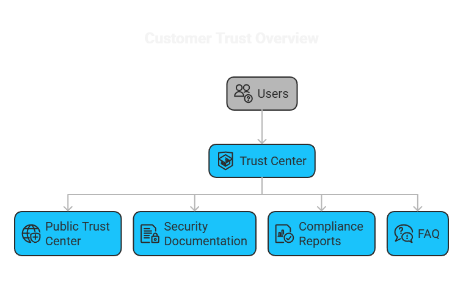
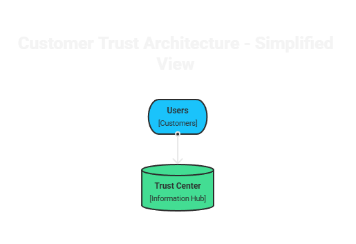

# Customer Security Overview

## Purpose

This document provides a concise overview of how security is approached in a modern cloud-based product environment.

It is intended for customers, prospects, and stakeholders who need a clear understanding of security posture without reviewing detailed internal standards.

---

## Scope

This overview covers governance, identity and access management, secure development, infrastructure protection, monitoring, incident response, and third-party risk at a high level.

It does not replace detailed policies, audit evidence, or customer-specific due diligence responses.

---

## Architecture Overview

This diagram shows how customer-facing security information is served through a structured system of services, data stores, and integrations.

This simplified view highlights how customers interact with the trust center as a single entry point.

This overview highlights the main customer-facing trust components, including the trust center, security documentation, compliance reports, and FAQ content.

---

## Security Approach

Security should support product reliability, customer trust, and responsible scale.

The operating approach is based on a few principles:

- security ownership should be clear
- controls should be practical and enforceable
- access should be limited based on role and need
- security should be integrated into delivery workflows
- security claims should reflect implemented practice

---

## Core Control Areas

### Governance

Security requires defined ownership, documented standards, and risk-based decision-making.

### Identity and Access Management

Access should follow least privilege principles, strong authentication requirements, and periodic review.

### Secure Development

Security controls should be integrated into design, code review, dependency management, and release processes.

### Infrastructure Security

Cloud and platform environments should be hardened, monitored, and administered through controlled access paths.

### Logging and Monitoring

Teams should maintain visibility into administrative activity, security-relevant events, and operational anomalies.

### Incident Response

Security events should be triaged, investigated, escalated, and resolved through defined procedures.

### Third-Party Risk

External tools, services, and dependencies should be reviewed in proportion to the level of access or risk they introduce.

---

## Customer Communication Principles

Customer-facing security communication should be:

- accurate
- clear
- consistent
- proportionate to the question being asked
- grounded in implemented controls

Statements should avoid overclaiming and should align with real operating practices.

---

## Common Customer Questions

Customers typically want to understand:

- how access is controlled
- how sensitive data is protected
- how changes are reviewed and deployed
- how incidents are handled
- how third-party services are evaluated
- how security responsibilities are divided across teams

---

## Intended Outcome

A clear customer security overview improves trust, reduces friction during due diligence, and provides a strong foundation for more detailed security discussions.
