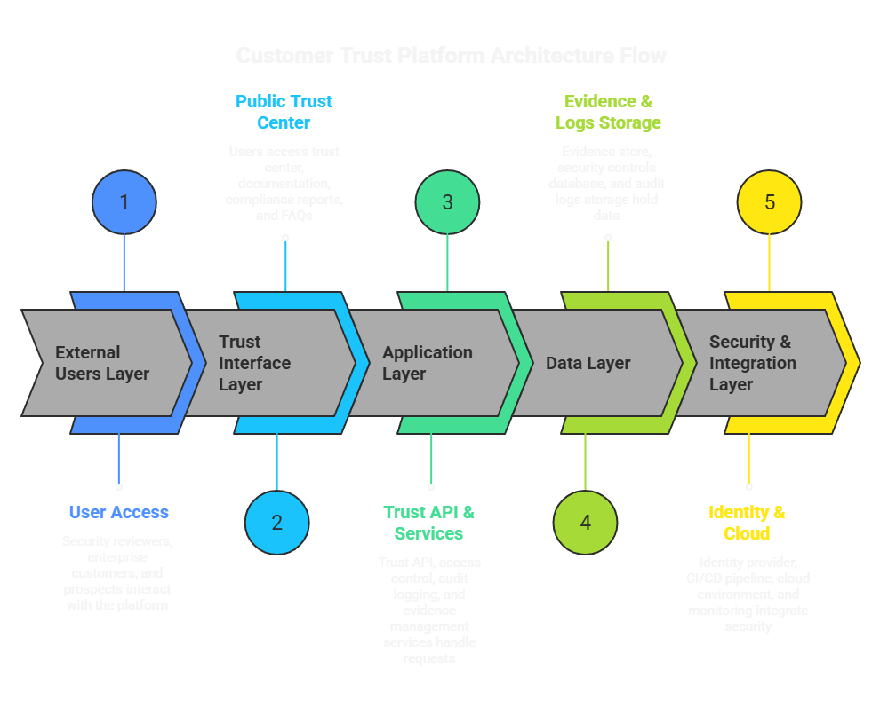

# Product Security Playbook

## Overview

This repository presents a structured product security playbook for modern cloud-based systems.

It demonstrates how security is designed, implemented, and communicated across architecture, identity, delivery pipelines, and customer interactions.

It focuses on how security is designed, communicated, and enforced across architecture, identity, delivery pipelines, and customer interactions.

The goal is to show how security supports product reliability, customer trust, and operational scale.

---

## What This Repository Covers

- security architecture and system design
- identity and access management
- threat modeling and risk analysis
- CI/CD and delivery pipeline controls
- software supply chain security
- customer-facing security communication

---

## Repository Structure

### [01-overview](01-overview/)
Core security principles and operating model  
- [security overview](01-overview/security-overview.md)  
- [shared responsibility model](01-overview/shared-responsibility-model.md)  

### [02-customer-trust](02-customer-trust/)
Customer-facing security communication  
- [security overview for customers](02-customer-trust/customer-security-overview.md)  
- [security questionnaire](02-customer-trust/customer-security-questionnaire.md)  

### [03-architecture](03-architecture/)
System design and risk analysis  
- [iam architecture](03-architecture/iam-architecture.md)  
- [threat model case study](03-architecture/threat-model-case-study.md)  

### [04-devsecops](04-devsecops/)
Security in delivery and dependencies  
- [ci/cd security controls](04-devsecops/ci-cd-security-controls.md)  
- [supply chain controls](04-devsecops/supply-chain-controls.md)  

### [06-ai-security](06-ai-security/)
AI security design and governance  
- [ai security overview](06-ai-security/ai-security-overview.md)  

---

## Example Architecture

This example shows how customer-facing security information is structured across application services, data layers, and integrations.

---

## How to Read This

- start with **[01-overview](01-overview/)** for context and operating model  
- review **[03-architecture](03-architecture/)** for system design thinking  
- explore **[04-devsecops](04-devsecops/)** for practical controls  
- use **[02-customer-trust](02-customer-trust/)** for external communication examples  

---

## Core Principles

- security should align with business objectives  
- controls should be practical and enforceable  
- access should be limited and observable  
- security should be integrated into delivery workflows  
- communication should be clear and accurate  

---

## Scope

This repository focuses on architecture, design, and communication.

It does not focus on tools, vulnerability scanning outputs, or vendor-specific implementations.

---

## Notes

All examples are generalized and do not represent any specific organization or system.
